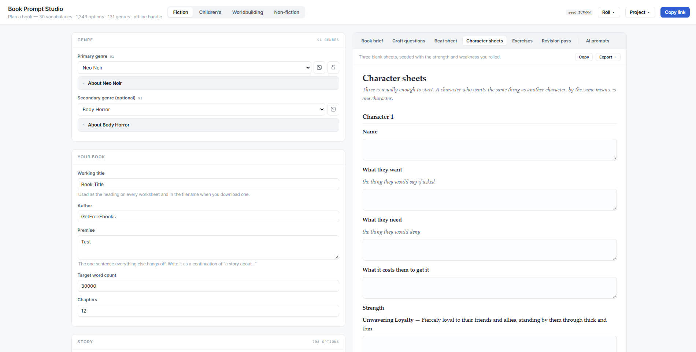
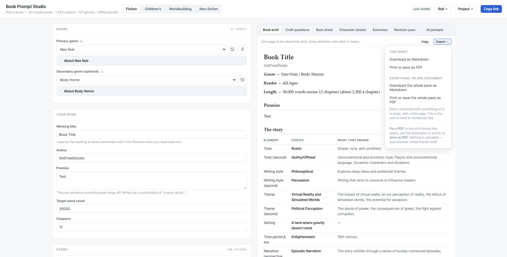
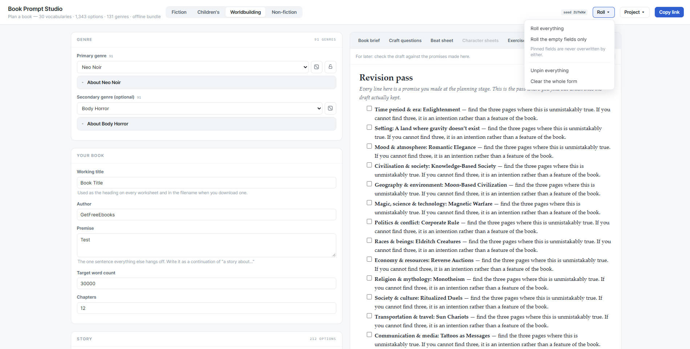
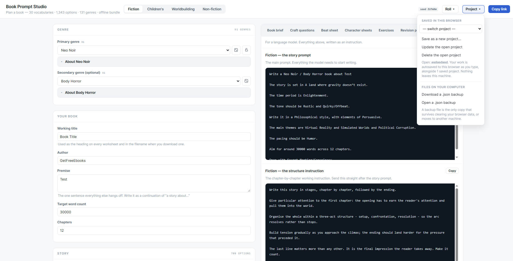

# Book Prompt Studio

**View demo - [https://dead0eye.github.io/free-book-prompt-studio/](https://dead0eye.github.io/free-book-prompt-studio/)**

What began as a tangled spreadsheet full of formulas is now a lightweight, standalone app.
No spreadsheet software required—just open and run.

A planning tool for writers. Pick or roll from **1,343 curated options across 30 vocabularies
and 131 genres**, and it turns those decisions into something you can work from.

Two ways to use it, from the same set of choices:

- **Writer mode** — a book brief, the craft questions your choices oblige you to answer, a beat
  sheet with the word budget already worked out, blank character sheets, timed exercises and a
  revision checklist. Print them, or export as Markdown into Scrivener or Obsidian.
- **Prompt mode** — the same decisions written as an instruction for a language model.

No build step, no dependencies, no account, no network calls, no telemetry. Two HTML/JS files
and five data files. **Double-click `index.html` and it runs.**

---

## Version

Version 1.0.0-beta - 9th September 2026
First public release

FIRST PUBLIC RELEASE - BETA

Everything here works and has been tested, but it has not yet been used by
many people on many machines. Please report anything that breaks.

* Four modes, ~1,300 options across thirty vocabularies
* Seven worksheets; six of them need no AI at all
* Seeded rolling with pinning
* Fillable worksheets - answers save, share and print
* A4 printing, filled or blank
* Named projects, file backup, shareable links
* No account, no server, nothing uploaded

---

## Screenshots


^ Book Prompt Studio + Fiction + Character Sheet


^ Book Prompt Studio + Fiction Book brief + Export


^ Book Prompt Studio + World Building + Roll


^ Book Prompt Studio + AI Prompt

---

## If you do not use AI

Most of this app is not about AI, and the parts that are can be ignored entirely — there is no
prompt on screen unless you open the tab marked **AI prompts**.

What it does instead is the boring, load-bearing part of planning a book, which is making
decisions and then being made to defend them. A dropdown that says *Unreliable Narrator* is
worth almost nothing on its own. The question it should provoke — *what does the narrator
believe that the reader must not, and on which page does the reader first suspect?* — is worth
an afternoon. Writer mode is the second thing.

Six sheets, built from whatever you have filled in so far:

| Sheet | What it is |
|---|---|
| **Book brief** | One page for above the desk. Every decision with what it actually means, because "Diegetic" will not mean anything to you in six weeks. |
| **Craft questions** | Questions generated from your specific choices — including the ones that only arise because two particular choices were made *together*. |
| **Beat sheet** | A three-act skeleton with the arithmetic done: which word, which chapter, how many words per act, how many writing sessions at 500 words a day. |
| **Character sheets** | Three blank sheets, the first seeded with the strength and weakness you rolled. |
| **Exercises** | Timed drills drawn from your own book, not from writing in general. Pen, paper, a clock. |
| **Revision pass** | For later. Every planning decision becomes a line to check the finished draft against. |

Every sheet prints properly — the interface disappears, the type goes serif, and the blank
rules become lines to write on. Every sheet also copies and downloads as Markdown.

### PDF and the whole pack

**Export → Print or save as PDF.** There is no PDF library here and there is not going to be
one: your browser's print dialog already has *Save as PDF* as a destination, it sets better
type than a bundled library would, it adds nothing to download, and the file is written on your
own machine with no request leaving it. The menu says so, because the one thing missing was
anybody knowing it was possible.

**Export → the whole pack** is the part a print dialog cannot do: every worksheet with
something on it, as one document, with a title page, the date, the seed and a contents list,
each sheet starting on a fresh page. That is the version to hand to a copywriter, a writing
group or a friend — as a PDF, or as one Markdown file. The AI prompts are deliberately left
out of it; an instruction addressed to a language model is not part of a writer's pack, and it
is still one tab away on its own.

The point is not that the app knows anything about your book. It is that 1,343 options are a
faster way to find the decision you actually want than a blank page is, and that having made a
decision, you should be asked to justify it while it is still cheap to change.

### Rolling is a starting position, not an oracle

Roll a form, throw out the eight choices that are wrong, **pin** the two that are interesting,
roll again. The pin button beside every field is the whole workflow: pinned fields survive
every roll, so the form converges on your book rather than resetting to noise.

---

## Run it

**The easy way.** Download or clone the folder and double-click `index.html`. It reads
`data/bundle.js`, an offline copy of the data, and works with no server.

**The developer way.** Serve it over HTTP and it reads `data/*.json` directly instead, so
hand-edits show up on reload:

```bash
python tools/serve.py
```

That serves on <http://localhost:8000>, opens a browser and sends no-cache headers so an edited
JSON file appears on the first reload rather than the third. Any static server does the same
job — `python -m http.server`, `npx serve`, VS Code's Live Server. It also drops straight onto
GitHub Pages, Netlify or any static host with no configuration.

---

## What it does

**Four modes.** Fiction, Children's, Worldbuilding, Non-fiction. Each shows only the fields
that matter to it.

**Roll, choose or pin.** Every field has a dice button and a pin. *Roll everything* fills the
whole form; *Roll empty* fills only the gaps. Neither ever touches a pinned field.

**On the seed.** *Roll everything* stamps a new seed and derives every choice from it, so
re-entering that seed reproduces that set exactly. The individual dice buttons are deliberately
not seeded — clicking one again should give you something new, which is the point of clicking
it. So the seed reproduces a **roll**, not necessarily the state you are looking at after a few
manual nudges. To capture that exactly, use **Copy link**: it carries every field, not just the
seed.

**Descriptions, not just labels.** Most options carry the explanation from the spreadsheet.
Picking "Hollow Earth" tells you it means *a secret world inside a planet*; picking a genre
opens a panel with what the genre is and two example titles. Writer mode puts those
explanations on the brief, which is the one place they are genuinely useful six weeks later.

**A half-filled form still works.** Sheets and prompts are built from what is set and stay
silent about what is not. Any prompt line whose field is empty is dropped rather than printed
with a gap in it, and fragments like `{{ and theme2}}` disappear when the second theme is
unset. You never have to fill everything to get something usable.

---

## Where your work is saved

Three places, and it is worth knowing which is which — **none of them is a server**. There is
no account, nothing is uploaded, and there is nothing to upload it to.

| Where | When | Survives |
|---|---|---|
| `localStorage` — working copy | Every keystroke, automatically | Closing the tab, restarting the browser |
| `localStorage` — named projects | When you press **Save as** | The same, and lets you keep several books side by side |
| A downloaded `.json` file | When you press **Download a .json backup** | Clearing browser data, reinstalling, moving machine |
| The URL, after **Copy link** | On demand | Anywhere you can paste a link |

`localStorage` is per-browser, per-machine, per-profile. Clearing your site data deletes both
the working copy and every saved project. **If a book matters, download the backup file.**
Project → *Download a .json backup*, and *Open a .json backup* reads it back on any machine.

The **Copy link** button encodes the entire state into the URL itself, which makes it the
easiest way to send a setup to someone else or bookmark one — the link contains the data, so
nothing is stored anywhere on either end.

---

### The files

| File | What it is | Maintained by |
|---|---|---|
| `data/vocab.json` | 29 vocabularies, grouped and described | the extractor — do not hand-edit |
| `data/categories.json` | 131 genres with descriptions and examples | the extractor — do not hand-edit |
| `data/craft.json` | Craft questions, exercises, beat structures | **by hand** |
| `data/templates.json` | The AI prompt templates | **by hand** |
| `data/bundle.js` | All four, as one script, for `file://` | `tools/bundle.py` — generated |

`craft.json` and `templates.json` are the hand-written ones. Neither is derived from the
spreadsheet: craft questions are craft guidance, and a spreadsheet formula is a miserable place
to edit a paragraph.

---

## Licence

[CC0 1.0 Universal](https://creativecommons.org/publicdomain/zero/1.0/) — public domain. The
code and the vocabularies in `data/` are both covered: take them, extend them, ship them in
your own tool. No attribution required, nothing to register.

The code used to be MIT while the data was CC0. Two licences for one small project meant every
contribution had to be sorted into the right bucket, and anyone reusing it had to read both.
One licence, and the most permissive one, is simpler for everybody.

Built by [GetFreeEbooks](https://getfreeebooks.com).
